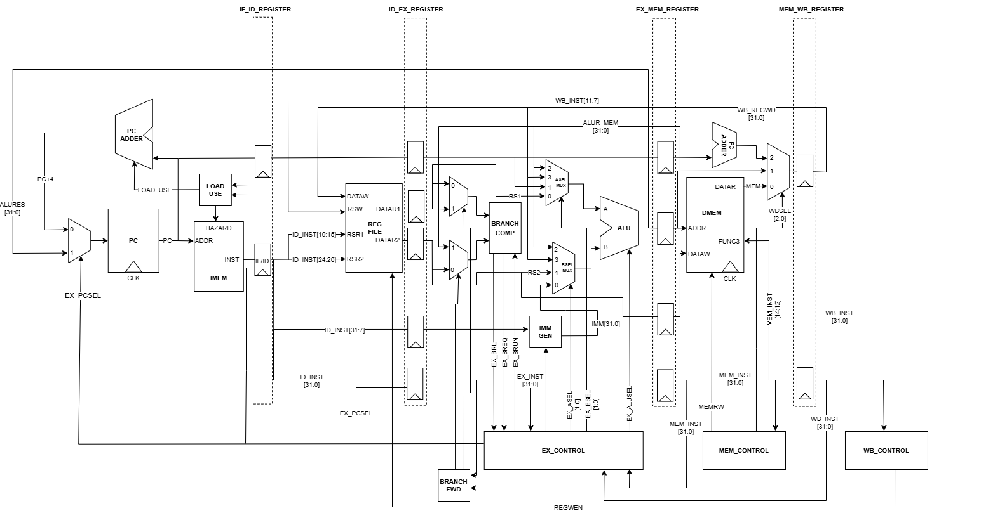

# RV32IM Pipelined Processor Design

## Team
- E/20/032, Bandara A.M.N.C., [e20032@eng.pdn.ac.lk](mailto:e20032@eng.pdn.ac.lk)
- E/20/034, Bandara G.M.M.R., [e20034@eng.pdn.ac.lk](mailto:e20034@eng.pdn.ac.lk)
- E/20/157, Janakantha S.M.B.G., [e20157@eng.pdn.ac.lk](mailto:e20157@eng.pdn.ac.lk)

## Table of Contents
1. [Abstract](#abstract)
2. [Datapath](#datapath)
3. [Supported Instructions](#supported-instructions)
4. [Features](#features)
5. [Hazard Handling](#hazard-handling)
6. [How to Build & Simulate](#how-to-build-and-simulate)
7. [References](#references)
8. [Links](#links)

## Abstract

This project focuses on the design and implementation of a custom 32-bit RISC-V processor supporting the RV32IM instruction set architecture (ISA). Developed as part of the Advanced Computer Architecture course (CO502), the processor encompasses essential features of the RISC-V standard, including integer operations (RV32I) and multiplication/division (M extension).

## Datapath

## Supported Instructions

| **Opcode** | **Instruction** | **Format** | **Description** | **Example** |
|------------|----------------|------------|-----------------|-------------|
| 0110011    | ADD            | R-Type     | rD = rS1 + rS2  | add r3, r1, r2 |
| 0110011    | SUB            | R-Type     | rD = rS1 - rS2  | sub r3, r1, r2 |
| 0110011    | AND            | R-Type     | rD = rS1 & rS2  | and r3, r1, r2 |
| 0110011    | OR             | R-Type     | rD = rS1 \| rS2 | or r3, r1, r2 |
| 0110011    | XOR            | R-Type     | rD = rS1 ^ rS2  | xor r3, r1, r2 |
| 0110011    | SLL            | R-Type     | rD = rS1 << rS2 | sll r3, r1, r2 |
| 0110011    | SLT            | R-Type     | rD = if (rS1 < rS2) return True | slt r3, r1, r2 |
| 0110011    | SLTU           | R-Type     | rD = if (rS1(uint) < rS2(uint)) return True | sltu r3, r1, r2 |
| 0110011    | SRA            | R-Type     | rD = rS1 >>> rS2 | sra r3, r1, r2 |
| 0110011    | MUL            | R-Type (M) | rD = (rS1 * rS2) [31:0] | mul r3, r1, r2 |
| 0110011    | MULU           | R-Type (M) | rD = (rS1(uint) * rS2(uint)) [31:0] | mulu r3, r1, r2 |
| 0110011    | MULH           | R-Type (M) | rD = (rS1 * rS2) [63:32] | mulh r3, r1, r2 |
| 0110011    | MULHU          | R-Type (M) | rD = (rS1(uint) * rS2(uint)) [63:32] | mulhu r3, r1, r2 |
| 0110011    | DIVU           | R-Type (M) | rD = (rS1(uint) / rS2(uint)) | divu r3, r1, r2 |
| 0110011    | DIV            | R-Type (M) | rD = rS1 / rS2  | div r3, r1, r2 |
| 0110011    | REM            | R-Type (M) | rD = rS1 % rS2  | rem r3, r1, r2 |
| 0010011    | ADDI           | I-Type     | rD = rS1 + imm  | addi r3, r1, 10 |
| 0010011    | SLTI           | I-Type     | rD = if (rS1 < imm) return True | slti r3, r1, 0xFF |
| 0010011    | SLTIU          | I-Type     | rD = if (rS1(uint) < rS2(uint)) return True | sltiu r3, r1, 0xFF |
| 0010011    | SLLI           | I-Type     | rD = rS1 << imm | slli r3, r1, 0xFF |
| 0010011    | SRAI           | I-Type     | rD = rS1 >>> imm | srai r3, r1, 0xFF |
| 0010011    | ORI            | I-Type     | rD = rS1 \| imm | ori r3, r1, 0xFF |
| 0010011    | XORI           | I-Type     | rD = rS1 ^ imm  | xori r3, r1, 0xFF |
| 0000011    | LB             | I-Type     | Load byte from memory | lb r3, 0(r1) |
| 0000011    | LBU            | I-Type     | Load byte unsigned from memory | lbu r3, 0(r1) |
| 0000011    | LH             | I-Type     | Load halfword from memory | lh r3, 0(r1) |
| 0000011    | LHU            | I-Type     | Load halfword unsigned from memory | lhu r3, 0(r1) |
| 0000011    | LW             | I-Type     | Load word from memory | lw r3, 0(r1) |
| 0100011    | SB             | S-Type     | Store byte to memory | sb r3, 0(r1) |
| 0100011    | SH             | S-Type     | Store halfword to memory | sh r3, 0(r1) |
| 0100011    | SW             | S-Type     | Store word to memory | sw r3, 0(r1) |
| 1100011    | BEQ            | B-Type     | Branch if equal | beq r1, r2, label |
| 1100011    | BNE            | B-Type     | Branch if not equal | bne r1, r2, label |
| 1100011    | BLT            | B-Type     | Branch if less than | blt r1, r2, label |
| 1100011    | BGE            | B-Type     | Branch if greater than or equal | bge r1, r2, label |
| 1100011    | BLTU           | B-Type     | Branch if less than (uint) | bltu r1, r2, label |
| 1100011    | BGEU           | B-Type     | Branch if greater than or equal (uint) | bgeu r1, r2, label |
| 1101111    | JAL            | J-Type     | Jump and link | jal r1, label |
| 1100111    | JALR           | I-Type     | Jump and link register | jalr r1, r2, 0 |
| 0110111    | LUI            | U-Type     | Load upper immediate | lui r1, 0x12345 |
| 0010111    | AUIPC          | U-Type     | Add upper immediate to PC | auipc r1, 0x1000 |

## Features
- **5-Stage Pipeline**: IF, ID, EX, MEM, WB
- **Hazard Handling**:
  - Load-use hazard detection and NOP insertion
  - Control hazard handling with pipeline flushing
  - Data hazard mitigation via forwarding
- **Memory Unit**: Supports **load/store operations** (LB, LH, LW, SB, SH, SW)
- **ALU Operations**: Supports arithmetic, logical, and branching instructions
- **Register File**: 32 general-purpose registers with asynchronous reads
- **Instruction Memory (IMEM) & Data Memory (DMEM)**

## Hazard Handling
The processor handles hazards using the following techniques:

**Load-Use Hazard**: Detects dependencies between load instructions and subsequent dependent instructions. Inserts a **NOP** to the pipeline.

**Data Hazard**: Uses a **Forwarding Unit** to forward register values from MEM and WB stages to EX stage.

**Control Hazard**: Implements **pipeline flushing and instruction replacement** when a branch is taken.

## How to Build and Simulate

### Requirements
- VHDL Simulator (ModelSim, GHDL, Xilinx Vivado)
- GTKWave

### Simulate
Navigate to the working directory and make sure all files are in the directory. Analyze all .vhdl files before running main.vhdl:
 ghdl -a *.vhdl
 ghdl -e main
 ghdl -r main --wave=wave.ghw
 gtkwave wave.ghw

## References
- Hennessy, J. L., & Patterson, D. A. (2020). Computer Architecture: A Quantitative Approach.
- IEEE Std 1800-2019: SystemVerilog—Unified Hardware Design.
- Installing GHDL and GTKWave: https://www.youtube.com/watch?v=0JJku1vTu78
- Learn VHDL: https://nandland.com/learn-vhdl/

## Links
- [Project Repository](https://github.com/cepdnaclk/e20-co502-RV32IM_Pipelined_Processor_Group-04)
- [Project Page](https://cepdnaclk.github.io/e20-co502-RV32IM_Pipelined_Processor_Group-04/)
- [Department of Computer Engineering](http://www.ce.pdn.ac.lk/)
- [University of Peradeniya](https://eng.pdn.ac.lk/)
